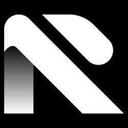

# My Personal Website

<p align="center">
  
</p>

Welcome to my personal website project! This website is built using [Next.js](https://nextjs.org/) and serves as a platform to showcase information about me, my open-source projects, writings, ebooks, and contact information.

## Design Mockup

For the design mockup of this website, you can view it on Figma:
[View Figma Mockup](https://www.figma.com/file/cKOboscKKBYe3G0LIqWCZ9/Bearmentor-Project?type=design&node-id=0-1&mode=design&t=xX9Cy45IbV91dzyw-0)

## Features

- **Home:** Provides an overview about me.
- **Projects:** Lists my open-source projects, along with the technologies used and demo links.
- **Writing:** Features my writings.
- **Ebooks:** Lists my ebooks.
- **Contact:** Provides links to my social media profiles for contacting me.

## Technologies Used

- React.js
- HTML5
- CSS3
- JavaScript

## Getting Started

To get a copy of this project up and running on your local machine for development and testing purposes, follow these steps:

1. Clone the repository:
```bash
git clone https://github.com/azizramdan/bearmentor-personal-website.git
```

2. Navigate to the project directory:
```bash
cd bearmentor-personal-website
```

3. Install dependencies:
```bash
npm install
```

4. Start the development server:
```bash
npm run dev
```

5. Open your browser and visit [http://localhost:3000](http://localhost:3000) to view the website.

## Deployment

This website can be deployed using platforms like Netlify, Vercel, or GitHub Pages. Follow their respective documentation to deploy the website.

## Contributing

Contributions are welcome! Feel free to open issues or pull requests for any improvements or bug fixes.

## License

This project is licensed under the [MIT License](LICENSE).
